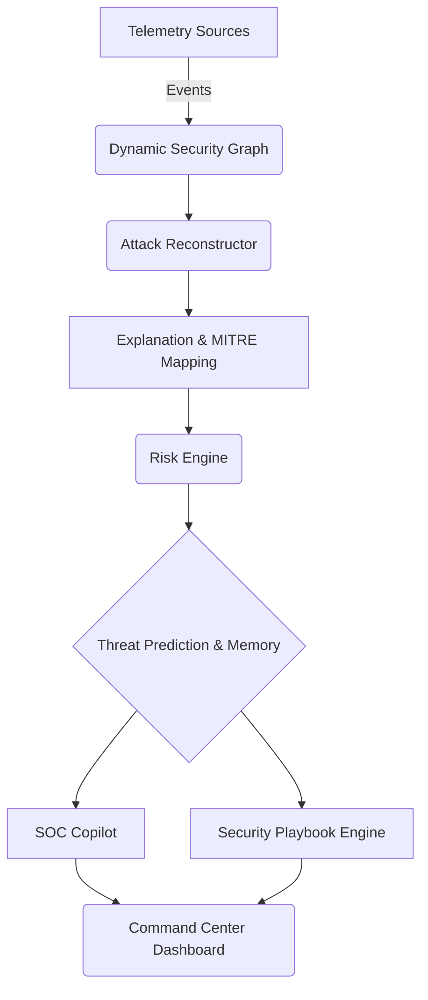

# Neurobrain X: Enterprise Architecture

## Overview
Neurobrain X has evolved from a hackathon-ready prototype into an enterprise-grade Autonomous Cyber Defense Platform. The core philosophy remains: deterministic, graph-based attack reconstruction combined with autonomous threat intelligence and response.

## Phases 1-10 Architecture

1. **Ingestion & Processing Layer (Phases 1-2)**
   - Event normalization and deduplication.
   - Dynamic Security Graph generation to model spatial and temporal relationships.

2. **Reconstruction & Inference Layer (Phases 3-4)**
   - Graph traversal with deterministic scoring (Temporal, Network, Spatial, Identity).
   - Inferred Gaps to connect disparate alerts despite missing telemetry.
   - Identity Continuity (Phase 4A) to track behavioral anomalies across sessions.

3. **Intelligence & Visualization Layer (Phases 5-7)**
   - Attack Describer translating graph paths into human-readable narratives.
   - MITRE ATT&CK Mapping for standardized threat classification.
   - Command Center UI with Spline 3D visualization.

4. **Autonomous Response Layer (Phases 8-9)**
   - Enterprise Risk Engine dynamically adjusting asset criticality.
   - SOC Copilot utilizing LLM-like logic via deterministic narratives.
   - Automated Response Engine to suggest defense active engagements.

5. **Enterprise Intelligence Layer (Phase 10)**
   - **Security Memory**: Long-term retention of historical incidents and analyst feedback.
   - **Threat Prediction Engine**: Forecasts attacker's next moves using MITRE patterns and historical context.
   - **Playbook Engine**: Generates automated incident response workflows tailored to risk severity.
   - **Enterprise Asset Model**: Multi-tenant support with robust asset tracking.

## Data Flow

## Security Layers
- **Determinism**: Unlike black-box ML models, every score, edge, and inferred gap can be explicitly audited.
- **Explainability**: No decision is made without a generated narrative.
- **Scalability**: Graph traversal limits depth and inferred gaps to maintain O(N) performance on localized threat clusters.

## Why Neurobrain X is Different
Traditional SIEMs aggregate logs and generate isolated alerts. Neurobrain X actively reconstructs the attacker's story, connecting the dots through deterministic graph rules, and automatically generates predicted next steps and defensive playbooks. It acts not just as an alert monitor, but as an autonomous tier-1 SOC analyst.
